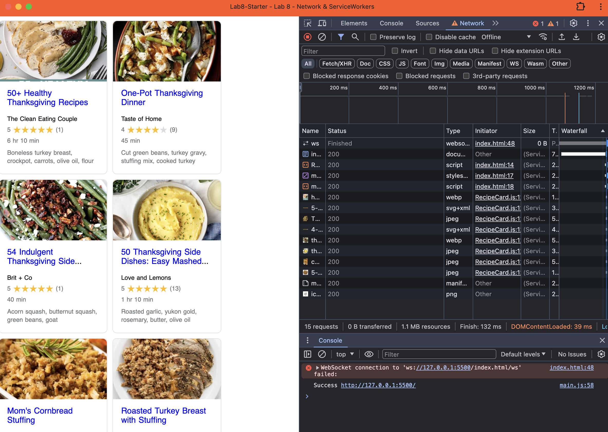

# Lab8-Starter
*Newton Chung*  
*Gavin Guyal*  

Service workers and graceful degradation are actually pretty similar. Both are primarily used on application usability and accessibility. Service workers would focus on a local-first user standpoint, which allows for offline use on apps. Graceful degradation allows for wide-usage across multiple different devices. 
 

[Link to website](https://newtonlc.github.io/Lab8-Starter/)
